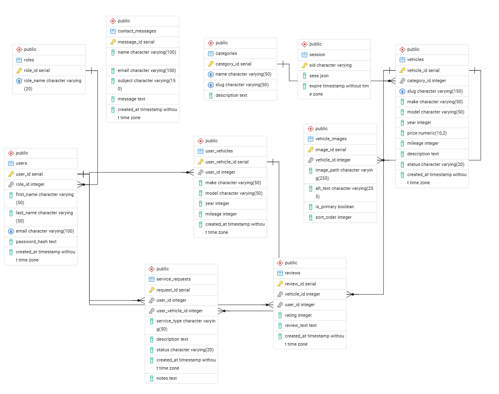

# Wasatch Auto Group

Wasatch Auto Group is a full-stack used car dealership web application built for the BYU-I CSE340 final project. The site is designed for customers browsing dealership inventory, leaving vehicle reviews, managing their own vehicles, and submitting service requests. It also includes employee and admin tools for dealership operations and system management.

## Project Description

This site is for a used car dealership and its customers and staff.

Customers can:

- browse available inventory
- filter by category
- view individual vehicle detail pages
- leave reviews on vehicles
- edit and delete their own reviews
- add, edit, and delete their own vehicles
- submit service requests for their vehicles
- view service request history and status

Employees can:

- manage inventory
- update vehicle details
- manage service requests
- update service request status
- add service notes
- view contact messages

Admins can:

- do everything employees can do
- add, edit, and delete vehicles
- add, edit, and delete categories
- manage employee accounts
- view system activity and user data

## Database Schema

Add your exported ERD image to the `docs` folder, then use this image reference:

## User Roles

### User

A standard customer account. Users can browse inventory, manage their own vehicles, leave and manage their own reviews, and submit and track service requests.

### Employee

An employee account. Employees can manage inventory, view customer contact messages, and manage service requests.

### Admin

A full-access owner/admin account. Admins can manage vehicles, categories, employee roles, and system-wide activity and user data.

## Test Account Credentials

Use one account for each role type:

### User

- Email: `customer@test.com`

### Employee

- Email: `employee@test.com`

### Admin

- Email: `admin@test.com`

Password for all seeded accounts is the standard course password from the project instructions.

## Tech Stack

- Node.js
- Express
- EJS
- PostgreSQL
- express-session
- connect-pg-simple
- bcrypt
- express-validator
- pnpm
- Render

## Key Features

### Public Features

- homepage with featured vehicles
- inventory browse page
- category filtering
- vehicle detail pages
- contact form

### Logged-In User Features

- registration and login
- role-based dashboard access
- add, edit, and delete personal vehicles
- leave, edit, and delete reviews
- submit service requests
- view service request history and status

### Employee Features

- employee dashboard
- manage inventory
- manage service requests
- update status and notes
- view contact messages

### Admin Features

- admin dashboard
- add, edit, and delete vehicles
- add, edit, and delete categories
- manage employee accounts
- view system activity and user data

## Vehicle Images

Vehicle image metadata is stored in the `vehicle_images` table, while image files are served from the public folder. Placeholder images are used when a custom vehicle image is not available.

## Deployment

This project is deployed on Render.

`https://cse340-used-car-dealership.onrender.com/`

## Known Limitations

- Vehicle images are seeded and linked through the database rather than uploaded through an admin image-management interface.
- Category deletion may fail if vehicles are still assigned to that category.
- The application is designed for course-project scope rather than production dealership scale.

## Author

Randi Umphrey
